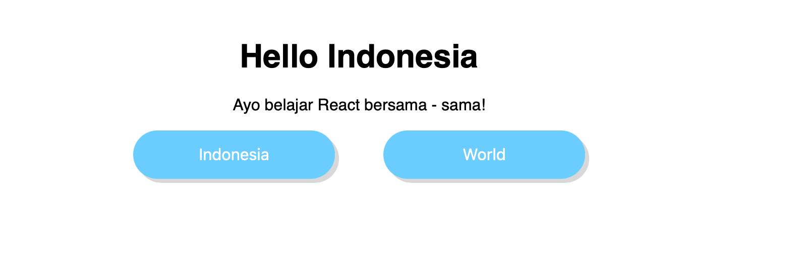
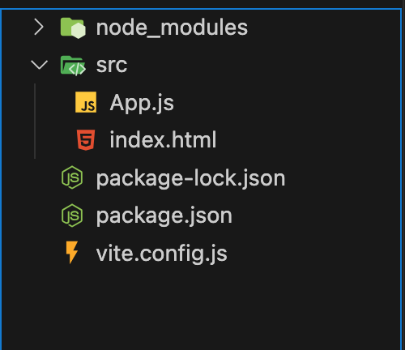
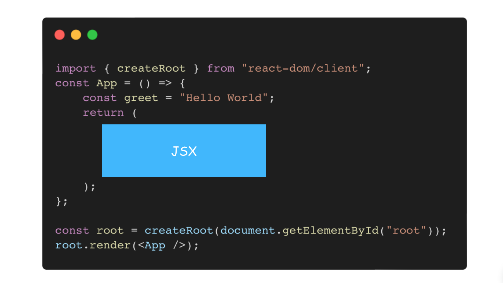

> Preview Hasil

React adalah library JavaScript yang memungkinkan Anda untuk membuat tampilan situs web.
Dan kali ini kita akan mengembangan front end menggunakan react js dan vite. Kenapa menggunakan vite?

Karena **Vite** dapat meningkatkan produktivitas kita dalam membangun aplikasi frontend dengan: Cold-start server development yang lebih cepat dibandingkan dengan bundle tools lain dengan memanfaatkan: pre-bundle dependencies menggunakan esbuild dan menyajikan source code ES module langsung di browser.

> _Cold start server_ web mengacu pada proses pemuatan awal _server_ web ketika mulai melayani permintaan setelah tidak aktif atau dimatikan.

Setiap orang punya preferensi masing masing untuk menggunakan tools yang diinginkan untuk setiap projeknya. Dan untuk kiblat saya dalam belajar react berpaku pada _Brian Holt_ - https://github.com/btholt yang merupakan mantan JavaScript engineer di Netflix, Microsoft and Reddit.

### Instalasi

Pastikan kamu sudah menginstall nodejs, jika belum menginstall silahkan kunjungi https://nodejs.org/en/download/ untuk mengunduh installer sesuai os yang kamu gunakan. Silahkan install package module dibawah ini:

```bash
# init project
npm init -y
```

```bash
npm install -D vite@3.1.4 @vitejs/plugin-react@2.1.0
```

> flag -D \_only adds the package to your "dev dependencies"

Karena ketika kita sudah ada pada tahap production, kemungkinan kita tidak menggunakan vite lagi. Jadi lebih baik kita install sebagai dev dependcies saja.

```bash
npm install react@18.2.0 react-dom@18.2.0
```

Kenapa tidak meng-install `npm install react react-dom`?, untuk mencegah terjadinya error karena perbedaan versi. Lebih baik menggunakan versi yang saya gunakan pada tutorial ini terlebih ini dahulu.

Sebelum itu kita setup vite terlebih dahulu dengan membuat nama file `vite.config.js` yang berisi kode ini:

```js
import { defineConfig } from "vite";
import react from "@vitejs/plugin-react";

export default defineConfig({
  plugins: [react()],
  root: "src",
});
```

Tambahkan custom scripts pada `package.json`

```js
"dev": "vite",
"build": "vite build",
"preview": "vite preview"
```

Lalu kita membuat folder `src/` dan file ~App.js~ dan `index.html`, maka strukturnya akan terlihat seperti ini:



Setelah itu kita modifikasi `App.js` dengen meng-import react, dan createRoot untuk membuat component pertama kita, dan men-rendernya.

```html
<!DOCTYPE html>
<html lang="en">
  <head>
    <meta charset="UTF-8" />
    <meta name="viewport" content="width=device-width, initial-scale=1.0" />
    <title>Document</title>
    <link rel="stylesheet" href="style.css" />
  </head>
  <body>
    <div id="root"></div>
    <script src="./App.js"></script>
  </body>
</html>
```

```js
// App.js
import React from "react";
import { createRoot } from "react-dom/client";

const App = () => {
  return React.createElement("h1", {}, "Hello React");
};

const root = createRoot(document.getElementById("root"));
root.render(React.createElement(App));
```

Untuk menjalakan web kita dengan command kita:

```bash
npm run dev
```

Selanjutnya kita akan menggunakan cara yang lebih mudah, untuk membuat sebuah markup / tampilan di React sangat mirip HTML. Namun sebenernya itu bukan html tapi disebut JSX.

Menulis JSX hampir sama dengan menulis HTML. Anda dapat menggunakan tag yang benar-benar sama seperti HTML, seperti `<h1>` dan `<h2>` untuk judul atau `<p>` untuk paragraf, dan `<div>` untuk kolom dan container.

Ketika JSX diletakkan di antara simbol `{/* dan */}`, teks di dalamnya akan menjadi komentar. Komentar tidak akan ditampilkan di browser dan tidak akan mengubah hasil code Anda. Sebagian editor teks akan menunjukkan komentar dalam teks warna abu-abu.



```jsx
import { createRoot } from "react-dom/client";
const App = () => {
  return (
    <div>
      {/* tidak di tampilkan */}
      <h1>Hello World</h1>
      <p>Ayo belajar React bersama - sama!</p>
    </div>
  );
};

const root = createRoot(document.getElementById("root"));
root.render(<App />);
```

> Jangan lupa menggubah `<script src="./App.js"></script>` menjadi `.jsx`

Di HTML, tag img tidak memiliki tag penutup sehingga dapat ditulis seperti ``. Namun, tag penutup diperlukan oleh tag img di dalam JSX seperti ``. ingatlah didalam JSX, tag img harus diakhir dengan `/`.

```jsx
import { createRoot } from "react-dom/client";

const App = () => {
  return (
    <div>
      <h1>Hello World</h1>
      <p>Ayo belajar React bersama - sama!</p>
      {/* Gunakan tag  untuk menampilkan gambar */}
      
    </div>
  );
};

const root = createRoot(document.getElementById("root"));
root.render(<App />);
```

Bahkan di kolom return, JavaScript dapat ditulis di dalam JSX. Untuk melakukan ini, code JavaScript harus diletakkan di dalam tanda kurung kurawal { }. Selain itu, nilai atribut tag juga dapat disisipkan ke dalam JSX dengan tanda kurung kurawal { } (seperti contoh di sebelah kanan).

```jsx
import { createRoot } from "react-dom/client";

const App = () => {
  const imageURI = "https://i.giphy.com/JRE3AvLsSRXg360F6l.webp";
  return (
    <div>
      <h1>Hello World</h1>
      <p>Ayo belajar React bersama - sama!</p>
      {/* Gunakan tag  untuk menampilkan gambar */}
      
    </div>
  );
};

const root = createRoot(document.getElementById("root"));
root.render(<App />);
```

Untuk mengubah apa yang ditampilkan jika seseorang mengklik suatu tombol, kamu butuh 2 alat, event dan state.

Pertama, kita akan membuat beberapa tombol untuk ditekan. Tombol dapat dibuat dengan tag `<button>`. Semua kata yang diletakkan di tag `<button>` akan ditampilkan di tombol.

```jsx
// App.js
import { createRoot } from "react-dom/client";

const App = () => {
  return (
    <div>
      <h1>Hello World</h1>
      <p>Ayo belajar React bersama - sama!</p>
      <button>Indonesia</button>
      <button>World</button>
    </div>
  );
};

const root = createRoot(document.getElementById("root"));
root.render(<App />);
```

Agar lebih menarik anda bisa menggunakan css ini dan simpan beri nama `style.css`, lalu untuk menghubungkannya kita hanya perlu memanggilnya pada `index.html`.

```css
body {
  margin: 0;
  padding: 0;
  font-family: sans-serif;
  text-align: center;
  min-width: 600px;
}

#root {
  margin-top: 40px;
}

button {
  display: inline-block;
  font-size: 16px;
  width: 200px;
  height: 48px;
  border-radius: 48px;
  margin-right: 24px;
  margin-left: 24px;
  color: #fff;
  background-color: #66ccff;
  border: none;
  outline: none;
  box-shadow: 4px 4px #d8d8d8;
  cursor: pointer;
  -webkit-appearance: none;
  -moz-appearance: none;
  appearance: none;
}

button:active {
  position: relative;
  top: 4px;
  left: 4px;
  box-shadow: none;
}
```

```html
<!DOCTYPE html>
<html lang="en">
  <head>
    <meta charset="UTF-8" />
    <meta name="viewport" content="width=device-width, initial-scale=1.0" />
    <title>Document</title>
    <link rel="stylesheet" href="style.css" />
  </head>
  <body>
    <div id="root"></div>
    <script type="module" src="./App.jsx"></script>
  </body>
</html>
```

Dengan event, Anda dapat menentukan kapan sebuah code akan dijalankan. Dengan arrow function yang anda dapat membuat perintah untuk hanya menjalankan code ketika suatu event terjadi, gunakan code berikut: `eventName={() => { code }}`. Karena arrow function adalah fungsi JavaScript, jangan lupa untuk mengapitnya dengan tanda kurung kurawal `{ }.`

Kita dapat menggunakan event onClick untuk menjalankan code ketika element tertentu diklik. Nama untuk event ini sebaiknya adalah onClick. Contoh penulisan di element button adalah `<button onClick={() => {code}}`>. Tulis code yang ingin dijalankan ketika event klik terjadi di dalam tanda kurung kurawal { } (posisinya terletak di bagian {code} pada arrow function).

Untuk memastikan code di gambar kanan berfungsi ketika sebuah tombol diklik, kita dapat menggunakan `console.log().` Anda dapat mencetak pesan dengan `console.log()` di dalam arrow function untuk event onClick.

```jsx
import { createRoot } from "react-dom/client";

const App = () => {
  return (
    <div>
      <h1>Hello World</h1>
      <p>Ayo belajar React bersama - sama!</p>
      <button onClick={() => console.log("Indonesia")}>Indonesia</button>
      <button onClick={() => console.log("World")}>World</button>
    </div>
  );
};

const root = createRoot(document.getElementById("root"));
root.render(<App />);
```

Agar dapat mengubah nama yang akan ditampilkan ketika menekan salah satu tombolnya, Anda harus menggunakan alat kedua, state.

Selanjutnya, mari kita ubah bagian name dari Hello, (name)! di dalam code sehingga ketika sebuah tombol ditekan, nama yang ditunjukkan di atas berubah. Di React, nilai yang dapat dirubah berdasarkan tindakan pengguna disebut state. Kita dapat memperbarui state setiap kali tombol ditekan, lalu mengubah nama yang akan ditampilkan berdasarkan state.

```jsx
import { createRoot } from "react-dom/client";
import { useState } from "react";

const App = () => {
  const [name, updateName] = useState("Dunia!");
  return (
    <div>
      <h1>Hello {name}</h1>
      <p>Ayo belajar React bersama - sama!</p>
      <button onClick={() => console.log("Indonesia")}>Indonesia</button>
      <button onClick={() => console.log("World")}>World</button>
    </div>
  );
};

const root = createRoot(document.getElementById("root"));
root.render(<App />);
```

Dengan code di atas, nilai state secara default adalah `Dunia!`. Untuk mengubah nama yang ditampilkan ketika sebuah tombol diklik, kita akan meletakkan `updateName` di dalam method event onClick.
